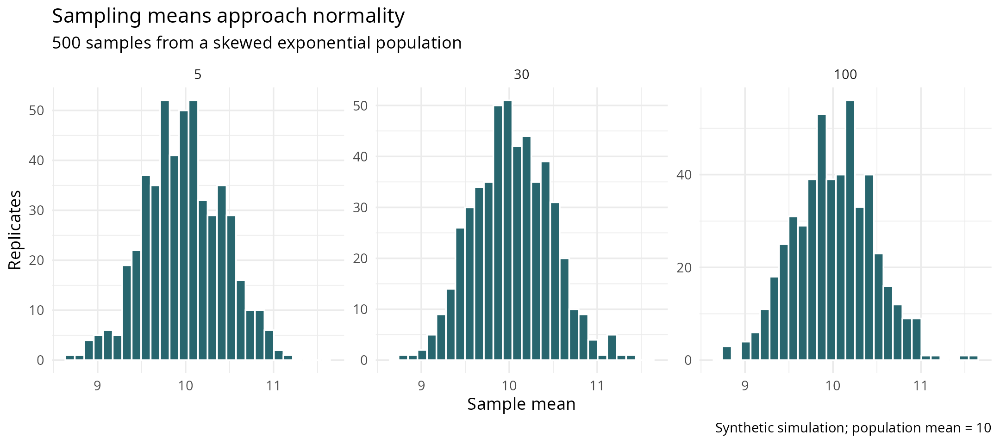
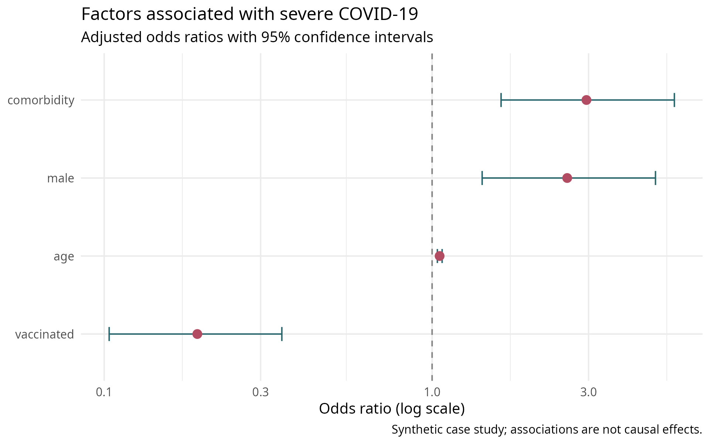

# R and Epidemiology Portfolio for SUS Research

This cumulative portfolio develops reproducible R workflows for descriptive epidemiology, statistical inference, regression, clustered data, forecasting, and survival analysis. It grew from learning undertaken in the Campus Virtual Fiocruz course **Introdução à Análise de Dados para Pesquisa no SUS**, while the code, simulations, presentation, and interpretations here are independently organized and written.

Official instructional files and raw educational datasets are not redistributed. Most examples use reproducibly generated synthetic data; the mortality workflow accepts a private local SIM-derived CSV.

## Skills map

| Module | Portfolio coverage |
|---|---|
| 1 — Programming and R | SIM import/validation, age classification, dates, grouped summaries, integrated mortality questions |
| 2 — Description and visualization | Variable types, location/dispersion, reusable summaries, Anscombe, honest scales, color and chart design |
| 3 — Statistical modelling | CLT/CI simulation, t tests, proportions, ANOVA/Tukey, linear/logistic/multilevel models, ARIMA, Kaplan–Meier, log-rank, Cox |

The [activity inventory](docs/activity_inventory.md) maps all 32 explicit source-supported activities/cases to portfolio-safe implementations.

## Representative examples



Five hundred repeated samples show how sample size changes the distribution of means from a skewed population. This is a simulation result, not evidence about a real health population.



The forest plot demonstrates adjusted logistic-regression reporting with odds ratios and 95% confidence intervals. The data are synthetic and associations must not be read causally.

## Repository structure

```text
scripts/   reproducible analyses grouped by method and course module
results/   generated tables and portfolio-quality figures
docs/      activity inventory, analysis notes, methods, reproducibility
```

## Reproduce

Install the packages listed in [reproducibility notes](docs/reproducibility.md), then run from the repository root:

```bash
for script in scripts/0{3..8}_*.R; do Rscript --vanilla "$script"; done
```

The SIM workflow is intentionally separate because its input is not public:

```bash
Rscript --vanilla scripts/01_sim_mortality_analysis.R /path/to/local_sim.csv results/tables
Rscript --vanilla scripts/02_visualize_results.R
```

## Interpretation and limitations

Generated examples demonstrate analytical techniques rather than population findings. Counts are not rates without denominators; odds ratios are not risk ratios; model fit does not establish causality; observational associations may reflect confounding, selection, or measurement error. See [methods notes](docs/methods_notes.md) and [analysis notes](docs/analysis_notes.md).

## Learning source

Learning inspiration and topic sequence: Campus Virtual Fiocruz, **Introdução à Análise de Dados para Pesquisa no SUS**. The [official course repository](https://github.com/CampusVirtualFiocruz/curso-analise-de-dados) remains the authoritative source for course materials.
