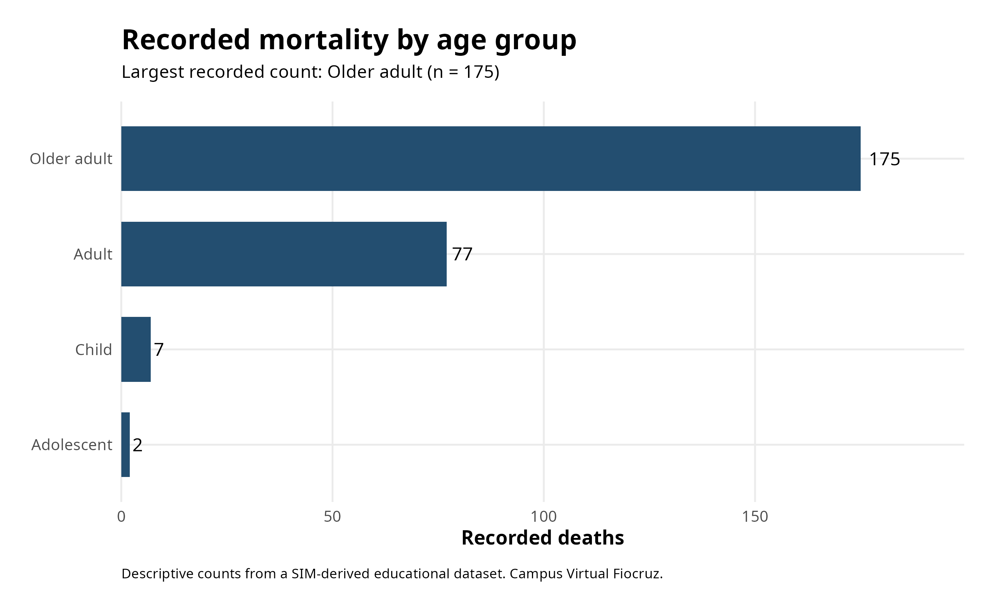
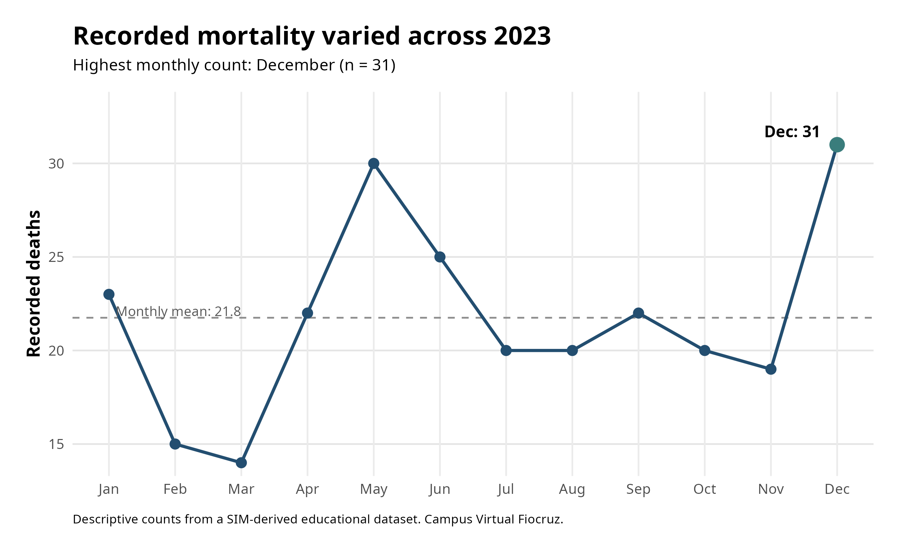

# SUS Mortality Data Analysis in R

A reproducible **descriptive epidemiology** project using R to explore
mortality records derived from Brazil's **Sistema de Informações sobre
Mortalidade (SIM)**.

The project began as part of a study of data analysis for research in
Brazil's Unified Health System (SUS) and extends introductory programming
exercises into a structured analytical workflow.

## Project focus

The analysis explores four descriptive questions:

1. How are recorded deaths distributed across broad age groups?
2. How does the number of recorded deaths vary throughout the year?
3. What descriptive differences appear between male and female mortality records?
4. How do mortality counts and mean age vary across quarters?

## Analytical workflow

The project demonstrates:

- reproducible R analysis from the command line;
- data import and validation;
- data wrangling with `dplyr`;
- date handling with `lubridate`;
- grouped summaries;
- descriptive epidemiology;
- generation of derived tables;
- data visualization with `ggplot2`;
- separation of source data, code and outputs.

## Visual summary

### Mortality by age group



### Monthly distribution of recorded deaths



## Repository structure

```text
.
├── README.md
├── scripts/
│   ├── 01_sim_mortality_analysis.R
│   └── 02_visualize_results.R
├── results/
│   ├── tables/
│   └── figures/
└── docs/
    └── analysis_notes.md
```

## Reproduce the analysis

Run the analytical script with the path to a local copy of the dataset:

```bash
Rscript scripts/01_sim_mortality_analysis.R \
  /path/to/sim_dataset.csv \
  results/tables
```

Then regenerate the figures:

```bash
Rscript scripts/02_visualize_results.R
```

## Data and interpretation

Raw educational data are not redistributed in this repository.

The analysis uses mortality records derived from the Brazilian
**Sistema de Informações sobre Mortalidade (SIM)** and provided through
Campus Virtual Fiocruz learning materials.

The outputs presented here are **descriptive counts and summaries**.
They should not automatically be interpreted as population mortality
rates. Rate-based epidemiological comparisons require suitable
population denominators and additional methodological considerations.

## Educational context

This project was developed while completing:

**Introdução à Análise de Dados para Pesquisa no SUS**  
**Campus Virtual Fiocruz**

The course introduces programming and data-analysis concepts using
Brazilian health-system data.

This repository extends those exercises into an independently organized,
reproducible descriptive epidemiology workflow.

Official course repository:

https://github.com/CampusVirtualFiocruz/curso-analise-de-dados
